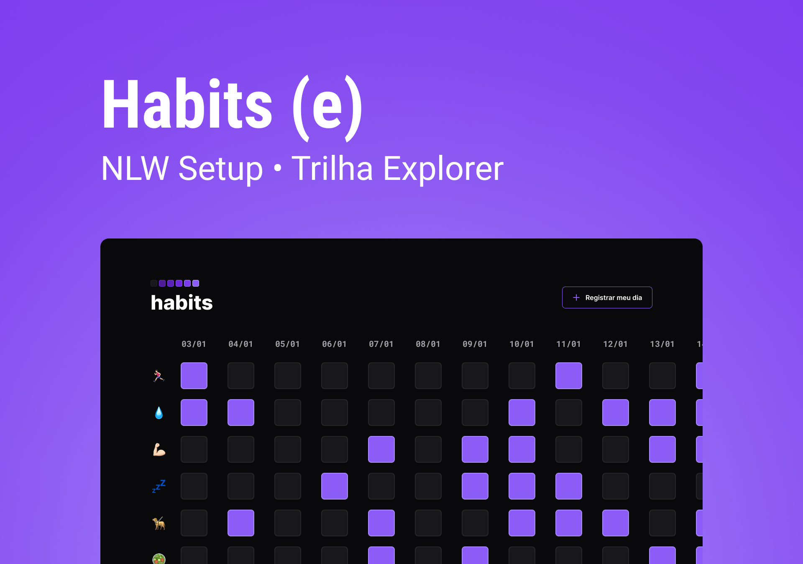

<h1 align="center"> Habits</h1>

Projeto desenvolvido a partir da participação do programa NLW - Trilha Explorer, evento exclusivo e gratuito promovido pela Rocketseat para o ensino de tecnologias WEB.
 

  <a href="#-tecnologias">Tecnologias</a>&nbsp;&nbsp;&nbsp;|&nbsp;&nbsp;&nbsp;
  <a href="#-projeto">Projeto</a>&nbsp;&nbsp;&nbsp;|&nbsp;&nbsp;&nbsp;
  <a href="#-layout">Layout</a>&nbsp;&nbsp;&nbsp;|&nbsp;&nbsp;&nbsp;
  <a href="#-memo-licença">Licença</a>
  

  

    
  

  

    
    

## 💻 Tecnologias

Esse projeto foi desenvolvido com as seguintes tecnologias:

- HTML e CSS;
- JavaScript;
- Git e Github;
- Figma

## 💡 Projeto

O Habits é um app para ajudar a rastrear os hábitos.

## 🎨 Layout

Você pode visualizar o layout do projeto através [DESSE LINK](https://www.figma.com/community/file/1187422022288947321). É necessário ter conta no [FIGMA](https://figma.com) para acessá-lo.

## 📃:memo: Licença

Esse projeto está sob licença MIT.
